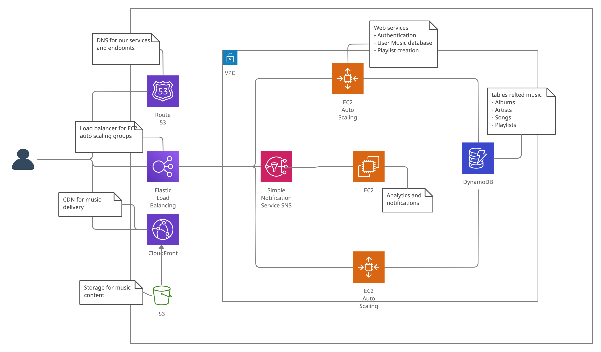

# Infrastructure

̦

**EC2**
Compute for running webservices

**EC2 Auto-scaling**
Auto scaling compute based on demand

**Elastic Load Balancing**
Load balancer for web services

**VPC**
Virtual Private Cloud inside AWS to run our web services

**Route 53**
DNS for our services and endpoints

**s3**
Storage for music files

**CloudFront**
CDN for music content delivery to reduce latency

**DynamoDB:**
NOSQL database for hosting database for music content
- Artists
- Albums
- Songs to S3 storage location
- Album arts to S3 storage location
- User created playlists 

**Simple Notification Service**

Notification service for
- Pushing notifications to user
- Collecting metrics related to usage, top charts and analytics

